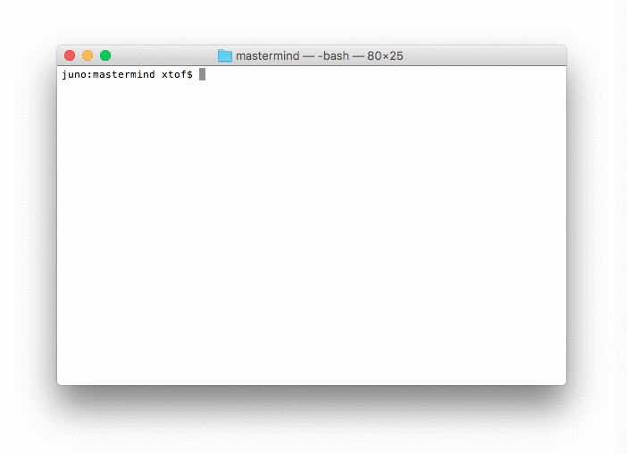

# MasterMind

A small project to dive into the Swift programming language.    
Christophe VG (<contact@christophe.vg>)  
[https://github.com/christophevg/mastermind](https://github.com/christophevg/mastermind)

## Introduction

Around Christmas 2016, our daughter got the new edition of [Mastermind](http://www.hasbro.com/nl-be/product/mastermind:93765D16-6D40-1014-8BF0-9EFBF894F9D4). Around that same time I was reading [iOS Programming Fundamentals with Swift](http://shop.oreilly.com/product/0636920055211.do). After finishing the first part on Swift, I needed a small project to get my hands dirty and try out some of that new programming language I'd been reading about.

Looking across the table to the game we just gave, resulted in this repository ;-)

The algorithm implemented is a slightly adapted version of the one described by [Donald Knuth](https://en.wikipedia.org/wiki/Mastermind_(board_game)#Five-guess_algorithm). I havent' really focussed on performance, but rather on getting to know language features to implement the code representation and solver in a _clean_ way.

Each code consists of 4 coloured balls, chosen out of 8 possible colours. Feedback on guesses is given in the form of red and white markers, with white indicating a correct colour, but in the wrong location, and red for a correct color in the correct location.

## Running the solver...

Below is a screencast of a session, in which a code is randomly chosen and then solved...



## Running all unit tests

To become familiar with writing unit tests in Swift, I added a few, without being exhaustive, nor thorough. 

```bash
$ make test
Compile Swift Module 'MasterMindTests' (1 sources)
Linking ./.build/debug/MasterMindPackageTests.xctest/Contents/MacOS/MasterMindPackageTests
Test Suite 'All tests' started at 2017-01-03 22:07:13.385
Test Suite 'MasterMindPackageTests.xctest' started at 2017-01-03 22:07:13.386
Test Suite 'CodeTests' started at 2017-01-03 22:07:13.386
Test Case '-[MasterMindTests.CodeTests testCodeByIndex]' started.
Test Case '-[MasterMindTests.CodeTests testCodeByIndex]' passed (0.008 seconds).
Test Case '-[MasterMindTests.CodeTests testCodeComparisonAllMisplaced]' started.
Test Case '-[MasterMindTests.CodeTests testCodeComparisonAllMisplaced]' passed (0.002 seconds).
Test Case '-[MasterMindTests.CodeTests testCodeComparisonEquality]' started.
Test Case '-[MasterMindTests.CodeTests testCodeComparisonEquality]' passed (0.000 seconds).
Test Case '-[MasterMindTests.CodeTests testCodeComparisonEverythingOkay]' started.
Test Case '-[MasterMindTests.CodeTests testCodeComparisonEverythingOkay]' passed (0.000 seconds).
Test Case '-[MasterMindTests.CodeTests testCodeComparisonHashValue]' started.
Test Case '-[MasterMindTests.CodeTests testCodeComparisonHashValue]' passed (0.000 seconds).
Test Case '-[MasterMindTests.CodeTests testCodeComparisonMixedResults]' started.
Test Case '-[MasterMindTests.CodeTests testCodeComparisonMixedResults]' passed (0.000 seconds).
Test Case '-[MasterMindTests.CodeTests testCodeComparisonNothingOkay]' started.
Test Case '-[MasterMindTests.CodeTests testCodeComparisonNothingOkay]' passed (0.000 seconds).
Test Case '-[MasterMindTests.CodeTests testCodeIndexBoundaries]' started.
Test Case '-[MasterMindTests.CodeTests testCodeIndexBoundaries]' passed (0.000 seconds).
Test Case '-[MasterMindTests.CodeTests testCodeSubscripting]' started.
Test Case '-[MasterMindTests.CodeTests testCodeSubscripting]' passed (0.000 seconds).
Test Case '-[MasterMindTests.CodeTests testDescription]' started.
Test Case '-[MasterMindTests.CodeTests testDescription]' passed (0.000 seconds).
Test Case '-[MasterMindTests.CodeTests testEqualCodes]' started.
Test Case '-[MasterMindTests.CodeTests testEqualCodes]' passed (0.000 seconds).
Test Case '-[MasterMindTests.CodeTests testIndexBasedColorInit]' started.
Test Case '-[MasterMindTests.CodeTests testIndexBasedColorInit]' passed (0.001 seconds).
Test Case '-[MasterMindTests.CodeTests testInvalidComparisonBoundaries]' started.
Test Case '-[MasterMindTests.CodeTests testInvalidComparisonBoundaries]' passed (0.000 seconds).
Test Case '-[MasterMindTests.CodeTests testNotEqualCodes]' started.
Test Case '-[MasterMindTests.CodeTests testNotEqualCodes]' passed (0.000 seconds).
Test Case '-[MasterMindTests.CodeTests testStringBasedColorInit]' started.
Test Case '-[MasterMindTests.CodeTests testStringBasedColorInit]' passed (0.000 seconds).
Test Case '-[MasterMindTests.CodeTests testTooFewParts]' started.
Test Case '-[MasterMindTests.CodeTests testTooFewParts]' passed (0.000 seconds).
Test Case '-[MasterMindTests.CodeTests testTooManyParts]' started.
Test Case '-[MasterMindTests.CodeTests testTooManyParts]' passed (0.000 seconds).
Test Case '-[MasterMindTests.CodeTests testValidComparisonBoundaries]' started.
Test Case '-[MasterMindTests.CodeTests testValidComparisonBoundaries]' passed (0.000 seconds).
Test Suite 'CodeTests' passed at 2017-01-03 22:07:13.400.
	 Executed 18 tests, with 0 failures (0 unexpected) in 0.013 (0.014) seconds
Test Suite 'MasterMindPackageTests.xctest' passed at 2017-01-03 22:07:13.400.
	 Executed 18 tests, with 0 failures (0 unexpected) in 0.013 (0.014) seconds
Test Suite 'All tests' passed at 2017-01-03 22:07:13.400.
	 Executed 18 tests, with 0 failures (0 unexpected) in 0.013 (0.016) seconds
```
